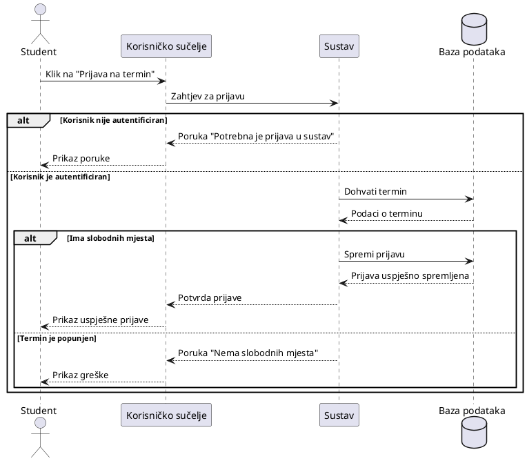
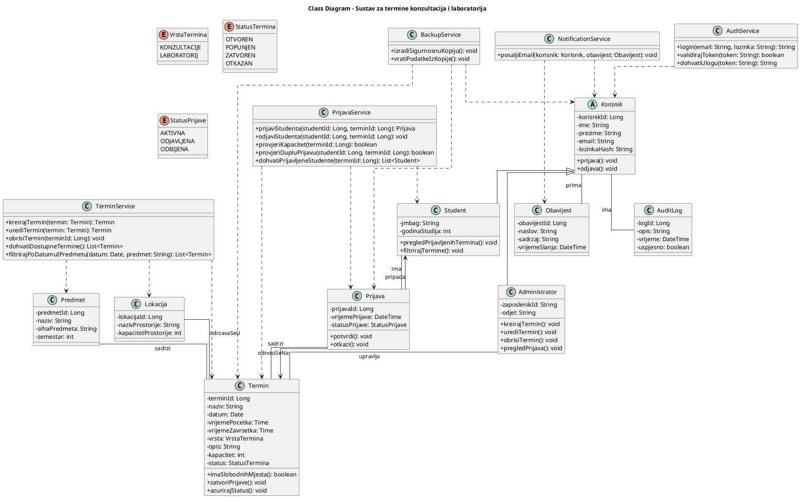
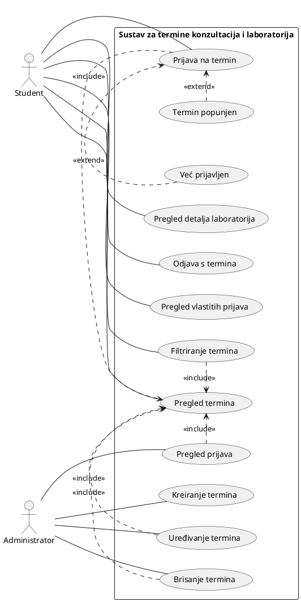

<!-- napravili Luka Hat i Antun Abičić --> 
# SEQUENCE

### PlantUML kod

## Kratki opis sequence dijagrama
Ovaj sequence dijagram prikazuje jedan konkretan scenarij: student se prijavljuje na odabrani termin konzultacija ili laboratorija.
Sudionici u scenariju su Student, Korisničko sučelje, Sustav i Baza podataka.
Student preko sučelja šalje zahtjev za prijavu. Sustav provjerava podatke o terminu i broj slobodnih mjesta. Ako termin ima slobodnih mjesta, prijava se sprema u bazu i student dobiva potvrdu. Ako nema slobodnih mjesta, sustav vraća poruku o grešci.

## Slika sequence dijagrama

<!-- napravio Petar Lukavec --> 
# Class diagram

PlantUML kod za class diagram:

## Kratki opis class diagrama

Ovaj model opisuje strukturu sustava za upravljanje terminima konzultacija i laboratorija te prikazuje glavne klase, korisničke uloge i servisne komponente. Apstraktna klasa `Korisnik` predstavlja zajedničke podatke svih korisnika, dok su `Student` i `Administrator` njezine specijalizacije s različitim odgovornostima. Klasa `Termin` opisuje pojedini termin, a `Prijava` povezuje studenta i termin te omogućuje evidenciju prijava i odjava. Dodatne klase `Predmet` i `Lokacija` služe za organizaciju termina po kolegiju i prostoru održavanja. Klase `Obavijest` i `AuditLog` podržavaju slanje email obavijesti te zapisivanje važnih događaja u sustavu. Veze među klasama prikazuju logične odnose između korisnika, termina i prijava, kao i ovisnosti između domenskih i servisnih komponenti. Po potrebi se model može dodatno proširiti zasebnom klasom za upravljanje sigurnošću lozinki, čime bi se osjetljivi podaci odvojili od osnovnih korisničkih podataka. 

# USE-CASE Dijagram

## Opis modela

Ovaj Use Case dijagram prikazuje funkcionalnosti sustava za upravljanje terminima konzultacija i laboratorija te interakciju dvaju aktera: studenta i administratora. Student može pregledavati termine, vidjeti detalje, filtrirati ih te se prijavljivati i odjavljivati, dok administrator može kreirati, uređivati i brisati termine te pregledavati prijave.

Odnosi <<include>> označavaju obavezne podkorake, pa tako više funkcionalnosti uključuje pregled termina jer je za njih potrebno prvo odabrati termin. Odnosi <<extend>> prikazuju iznimne situacije koje se mogu dogoditi prilikom prijave, kao što su pokušaj prijave na popunjen termin ili dupla prijava.

Dijagram time jasno prikazuje glavne funkcionalnosti sustava, uloge korisnika i osnovne scenarije korištenja zajedno s mogućim iznimkama.